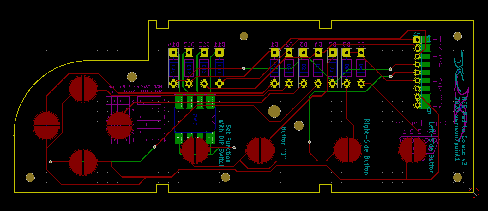

# ColecVision to NES Controller PCB Replacement
This PCB is designed to be swapped out with that of a standard NES controller to allow you to use it with a ColecoVision game console.  As this is a drop-in replacement, there is no need to modify or damage any of the original components of the NES controller.

## Bill of Materials
* 1 x DE9 Joystic cable (https://console5.com/store/atari-sega-commodore-coleco-msx-6-1-8m-joystick-controller-project-repair-cable-cord.html)
* 11 x 1N4148 Switching Diodes (https://www.mouser.com/ProductDetail/512-1N4148)
* 1 x 4 Position, Low-Profile DIP switch (https://www.mouser.com/ProductDetail/653-A6S-4104-H)
* 1 x OEM NES Control Pad (First Party NES Classic Control Pads may also work)

## Notes / Features
* I reversed the left and right fire buttons from the ColecoVision controller so that the NES "B" button corresponds with the right fire button, and the NES "A" button corresponds with the left.  I initially did this because it made Donkey Kong play closer to the NES version, but I found overall it also worked better for nearly every game I tried.
* The NES "Start" button is mapped to the number pad's "1" button because almost every game requires pressing "1" to start.
* The NES "Select" button can be mapped with the DIP switch on the back

[Test Video](TESTING.MOV)
## Mapping the "Select Button"

A handful of games require you to press some button other than "1" to start - for example Mario Bros. requires that you use "5" to add credits before you can play.  Because of this I thought it would be useful if you could just pick which button you want "Select" to imitate.  The settings are actually printed on the PCB, but I thought I'd include them here for reference.

| CV Button | 1 | 2 | 3 | 4 |
|-----------|---|---|---|---|
|         * |   | ↑ |   | ↑ |
|         0 | ↑ | ↑ |   |   |
|         1 |   |   |   | ↑ |
|         2 |   |   | ↑ |   |
|         3 | ↑ |   |   | ↑ |
|         4 | ↑ | ↑ | ↑ |   |
|         5 |   | ↑ | ↑ |   |
|         6 | ↑ |   |   |   |
|         7 |   |   | ↑ | ↑ |
|         8 |   | ↑ | ↑ | ↑ |
|         9 |   | ↑ |   |   |
|         # | ↑ |   | ↑ |   |

## Bill of Materials

* 1 x DE9 Joystic cable (https://console5.com/store/atari-sega-commodore-coleco-msx-6-1-8m-joystick-controller-project-repair-cable-cord.html)
* 11 x 1N4148 Switching Diodes (https://www.mouser.com/ProductDetail/512-1N4148)
* 1 x 4 Position, Low-Profile DIP switch (https://www.mouser.com/ProductDetail/653-A6S-4104-H)
* 1 x OEM NES Control Pad (First Party NES Classic Control Pads may also work)

## License
This work is licensed under a [Creative Commons Attribution-NonCommercial-ShareAlike 4.0 International License](http://creativecommons.org/licenses/by-nc-sa/4.0/).
